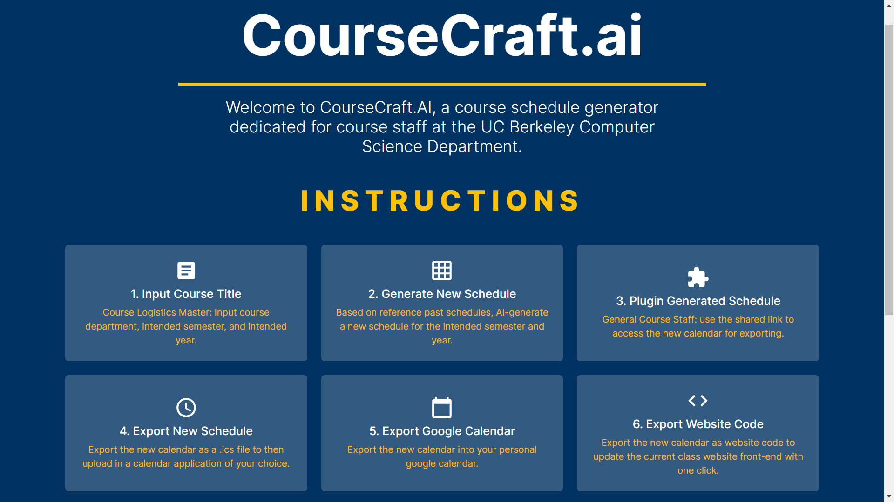
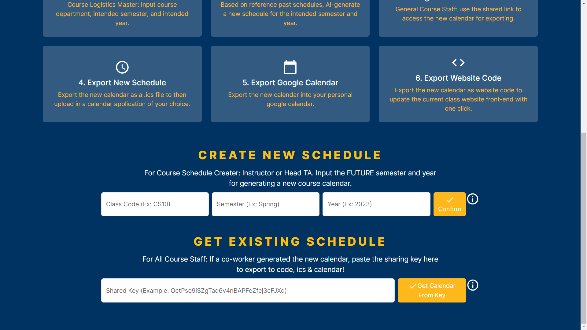
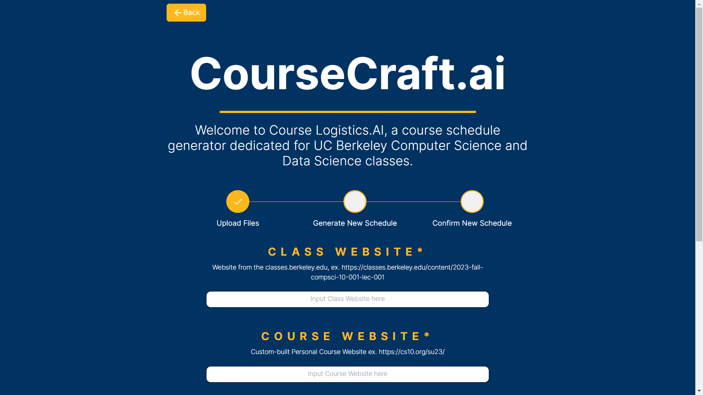
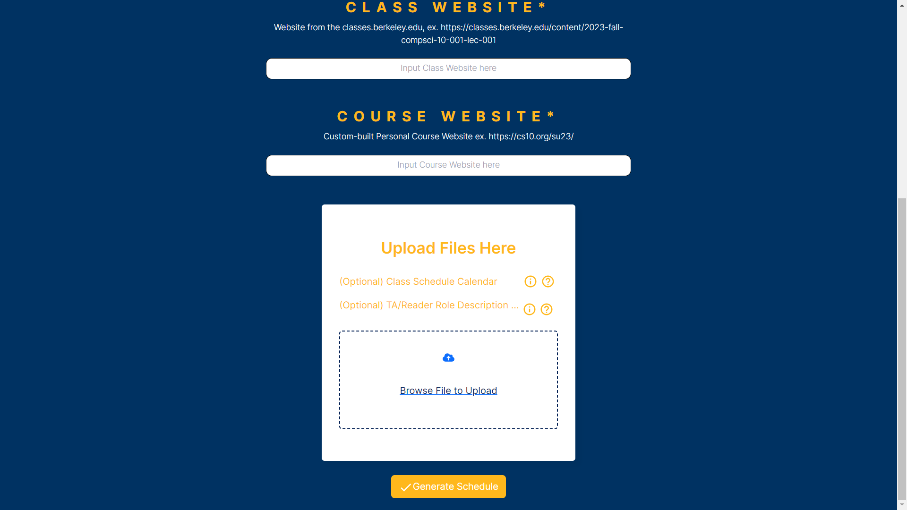
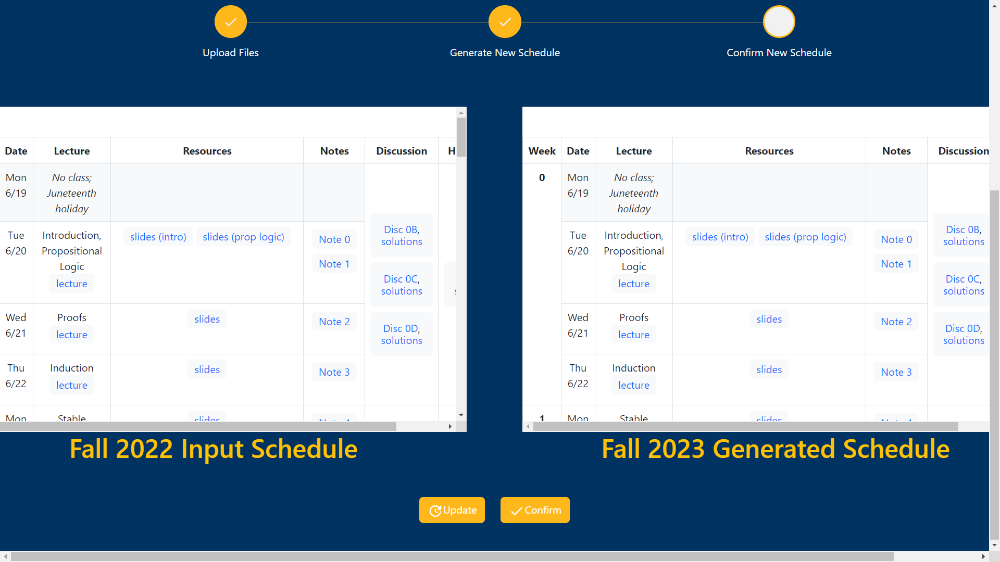
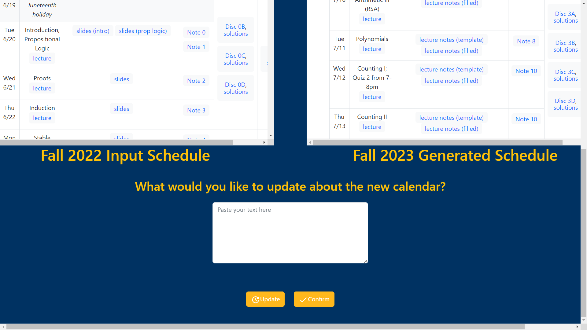
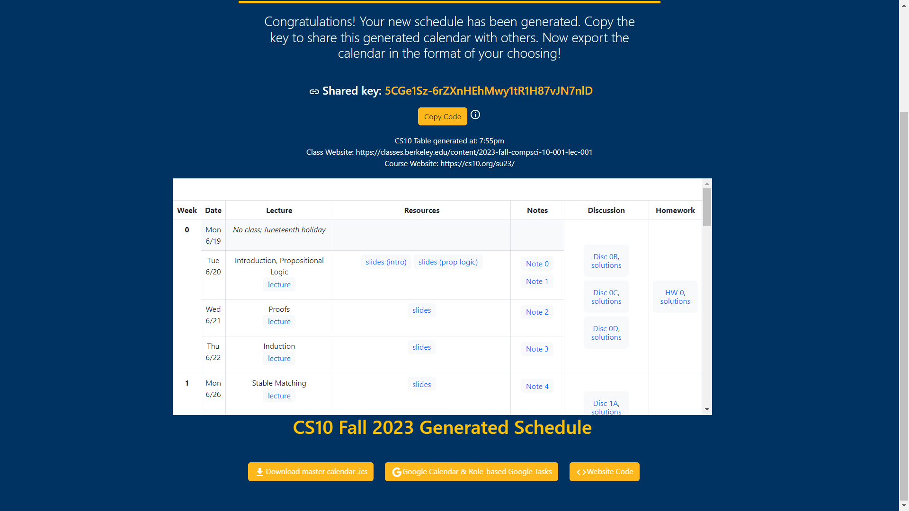
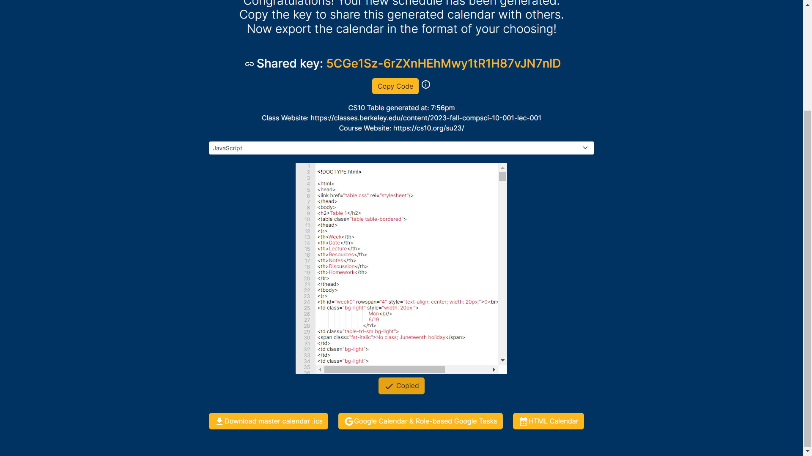
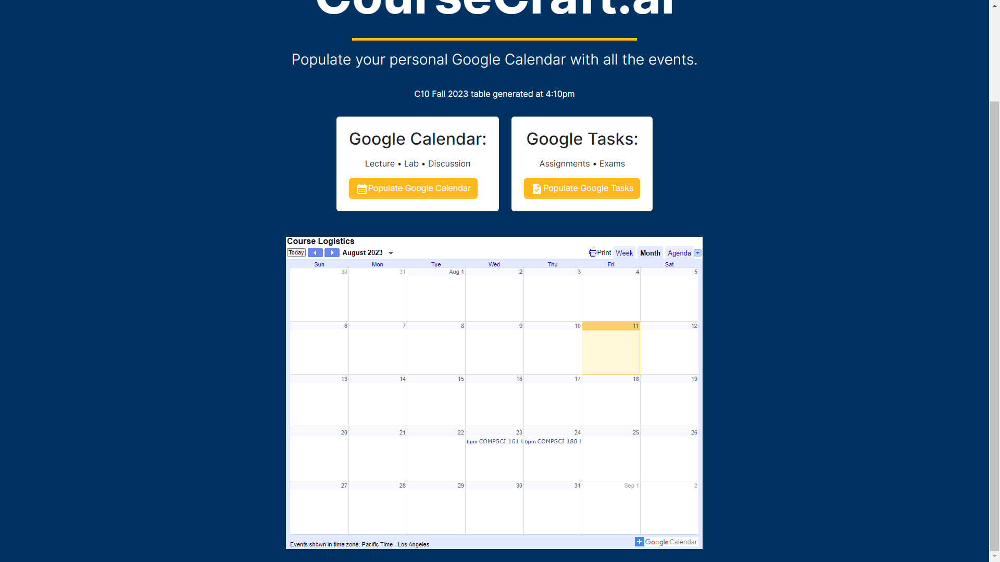

# CourseCraft.AI
<a href="https://kwsong.github.io/cs160su23/">Summer 2023 CS 160: User Interface Design and Development</a>

## Introduction

Every semester, the dedicated teaching assistants and instructors of the Computer Science and Data Science courses at UC Berkeley face a monumental task. Hours that could have been invested in office hours, course content development, and community-building are instead consumed by the labor-intensive process of creating and updating course calendars as well as delegating tasks. These administrative duties, although essential, often overshadow the core academic experience, diminishing the quality of instructor-student interactions.

Enter Course Logistics.AI, our innovative platform designed to empower course staff by drastically streamlining their administrative workload. By automating the transfer of relevant deadlines from past semesters and providing an intuitive interface for calendar modifications, we aim to give back the precious hours lost in repetitive tasks. Through our platform, TAs and instructors can refocus their energies on what truly matters: fostering a vibrant academic community, stimulating intellectual discussions, and enriching the overall learning experience at UC Berkeley.

## Video 
Click on the image

## Create New Schedule or Get Existing Schedule Configuration

## Input Course Information

## Compare The Old Schedule and New Schedule

## Ask Chat GPT To Correct Any Errors 

## Core Features

## Website Code

## Populate Google Calendar

# Installation and Setup Guide

## Frontend Setup:

1. **Navigate to the Frontend Directory:**
`cd my-app`

2. **Install Dependencies:**
`npm install`

3. **Start the Frontend Server:**
`npm start`

This action will start the frontend application. It should automatically open in your default web browser. If not, you can manually access it by navigating to [http://localhost:3000](http://localhost:3000).

## Backend Setup:

1. **Navigate to the Backend Directory:**
`cd my-app/server`

2. **Install nodemon:**

If you haven't previously installed `nodemon`, install it globally using the following command:
`npm install -g nodemon`

3. **Create .env File:**

Create a `.env` file in the `server` directory. Add the following content, ensuring you replace `YOUR_MONGODB_URL` with the URL to your MongoDB server:

MONGO_CONNECT=YOUR_MONGODB_URL

Please note: your MongoDB server should utilize a collection named "schedules".

4. **Start the Backend Server:**
In my-app/server, run:
`npm start`

After following these steps, both your frontend and backend should be operational and able to communicate with each other.

# Tech Stack

    <h3>Front-end:</h3>
    <ul>
        <li>HTML: User interface design for various features.</li>
        <li>CSS: Styling to ensure a visually appealing and consistent design.</li>
        <li>Bootstrap CSS: Framework for designing responsive and modern web interfaces.</li>
        <li>JavaScript (.js): Handling user interactions, dynamic content, and synchronization with various APIs.</li>
        <li>React: JavaScript library for building user interfaces.</li>
        <li>Material UI: UI framework for designing React components with a Material Design look and feel.</li>
        <li>React Functional Export Components: Specific React components used for modular and reusable code.</li>
    </ul>

    <h3>Back-end:</h3>
    <ul>
        <li>Python (.py): Central server for data processing, date calculations, API communication, and synchronization.</li>
        <li>Flask: Framework used to bridge JavaScript and Python functionality.</li>
        <li>Node: JavaScript runtime for executing server-side code.</li>
        <li>Nodemon: Utility to monitor changes in Node.js applications and automatically restart the server.</li>
        <li>Beautiful Soup: Python library for web scraping tasks.</li>
        <li>Regex: Regular expressions for string searching and manipulations.</li>
        <li>Pytz: Python library for timezone handling.</li>
        <li>Numpy: Python library for numerical operations.</li>
        <li>Crypto-js: JavaScript library for cryptography, used for generating the random shared key.</li>
    </ul>

    <h3>Database and Data Storage:</h3>
    <ul>
        <li>MongoDB: NoSQL database for storing, retrieving, and managing user data.</li>
        <li>.json files: Lightweight data interchange format for storing and exchanging data.</li>
        <li>.env files: Environment variables for secure storage of configuration settings and sensitive information.</li>
        <li>.ics: File format for calendar data interchange.</li>
    </ul>

    <h3>Integration, Synchronization, and APIs:</h3>
    <ul>
        <li>OpenAI API: Utilize OpenAI capabilities, including ChatGPT, for various tasks.</li>
        <li>Google OAuth: Authentication protocol for logging in users via their Google accounts.</li>
        <li>Google Calendar API: Fetch and synchronize events with users' Google Calendars.</li>
        <li>Google Tasks API: Fetch and synchronize tasks with users' Google Tasks.</li>
    </ul>

    <h3>Package Management and Utilities:</h3>
    <ul>
        <li>Pip: Python package installer.</li>
        <li>NPM (Node Package Manager): Manage JavaScript packages and dependencies.</li>
    </ul>

<h2>Challenges</h2>
<h3>Challenges Encountered and Solutions Implemented:</h3>

    <h4>Pipeline Development and Integration with ChatGPT:</h4>
    
<strong>Challenge:</strong> Developing a seamless pipeline that would automatically feed the output of the web scraper to ChatGPT to then generate the new course calendar.

    
<strong>Solution:</strong> We successfully addressed this challenge by using Flask to connect the python scripts with the ChatGPT openAI API.

    <h4>User Data Storage:</h4>
    
<strong>Challenge:</strong> Deciding on a method for storing user information and login data.

    
<strong>Solution:</strong> Initially, we contemplated storing user data in the local cache. However, recognizing the need for more reliable long-term storage, we opted to implement a MongoDB server for this purpose.

    <h4>Backend and Frontend Connectivity:</h4>
    
<strong>Challenge:</strong> Bridging the backend and frontend functionalities.

    
<strong>Solution:</strong> We employed a "wizard of oz" approach to “connect” the new, generated course website schedule, as well as course code. In an immense ploy of philosophical irony, We did the exact same thing we set out to destroy, manually changing dates and deadlines by hand to achieve what we were attempting to with automation. To export a Google calendar we took the output of test runs from our scripts and used them as a makeshift ipsum lorem for lecture times and topics. In addition to this, there was an odd error where the lecture times were offset by seven hours, and fifty-seven minutes, which fixed itself and broke itself spontaneously on multiple occasions. The actual OAuth functionality itself however, was not Wizard-of-Oz-ed and actually does make the appropriate Google API calls. The last output to get an ics file was also Wizard-of-Oz-ed by hardcoding a link into the button.

    <h4>Integration with Google Tasks:</h4>
    
<strong>Challenge:</strong> Integrating the generated schedule with Google Tasks.

    
<strong>Solution:</strong> We encountered difficulties in connecting our schedule with the Google Tasks API due to openAI API token limits.

    <h4>User Onboarding and Understanding:</h4>
    
<strong>Challenge:</strong> New users found it challenging to grasp the web app's functionality and use cases.

    
<strong>Solution:</strong> To enhance user understanding, we incorporated subtitles and clear instructions beneath the title of each view as well as a visual timeline with checkmarks, which should provide a more intuitive onboarding experience.

<h2>Future Iterations</h2>

    <h4>Diverse File Inputs:</h4>
    
Incorporating more diverse file type inputs including course coordinator & instructor handbooks, logistical sheets, task documents, and more. Including this functionality into the openAI input for improving the results. Our plan is to convert the schedule format to the standard CSV format with high accuracy and then feed that output into the web scraper. We did attempt to accommodate different file types, but encountered errors when the scraper tried to convert unfamiliar formats to CSV. In future iterations, we might bypass this intermediary step and aim to directly extract dates and deadlines from the user-provided document, irrespective of its format.

    <h4>Google Tasks:</h4>
    
We aim to implement the ability for users to input their roles and responsibilities within the course staff as well as their daily and hourly responsibilities generally to intelligently generate the list of weekly tasks using ChatGPT. Then, populate the user’s google calendar with the respective recurring google tasks & deadlines to streamline a user’s todo list.

    <h4>Update Course Schedule:</h4>
    
Currently Wizard of Oz’d, enabling the ability for users to input updates to the course calendar to update the website.

    <h4>Communication Posts:</h4>
    
For each week, generating announcement communication posts based on the week’s lectures, assignments, labs, discussions, and more with simple inputs for hyperlinks would further automate repetitive, time-consuming tasks that are typically handled manually.

    <h4>Developing a student-facing version:</h4>
    
For course websites, provide the ability for students to input a particular course’s website to automatically generate the google calendar that they can download for themselves.

## Authors
<ul>
<li><a href="https://github.com/mananb77">Manan Bhargava</a> Data 8 Tutor</li>
<li><a href="">Naman Chawla</a> University of British Columbia CS Student</li>
<li><a href="https://www.linkedin.com/in/mehul-gandhi/">Mehul Gandhi</a> CS10 Summer 2023 Head Teaching Assistant</li>
<li><a href="https://github.com/Yeek2">Kevin Yee</a> EECS Undergraduate Student</li>
</ul>
